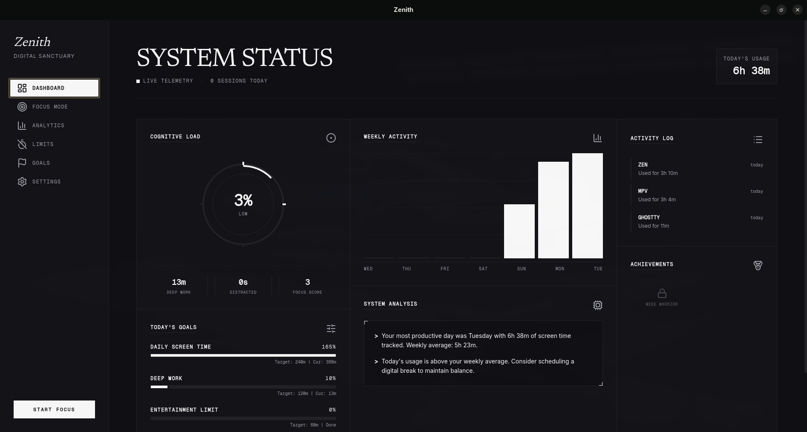
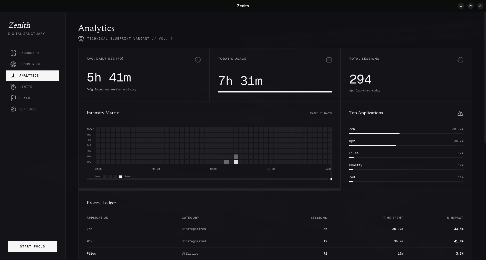
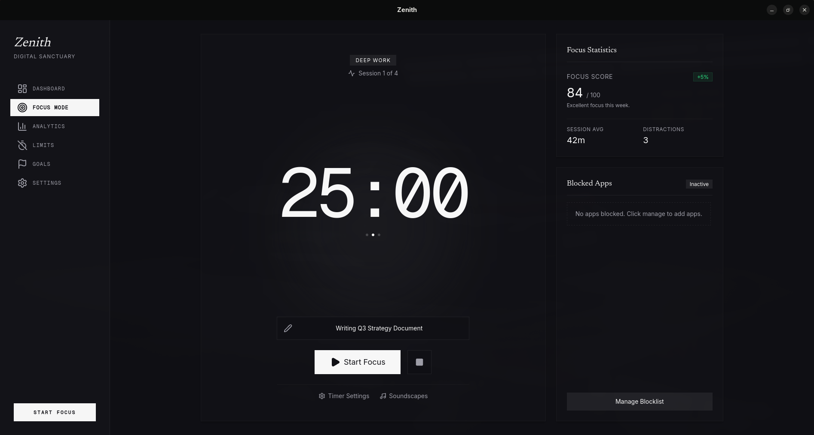
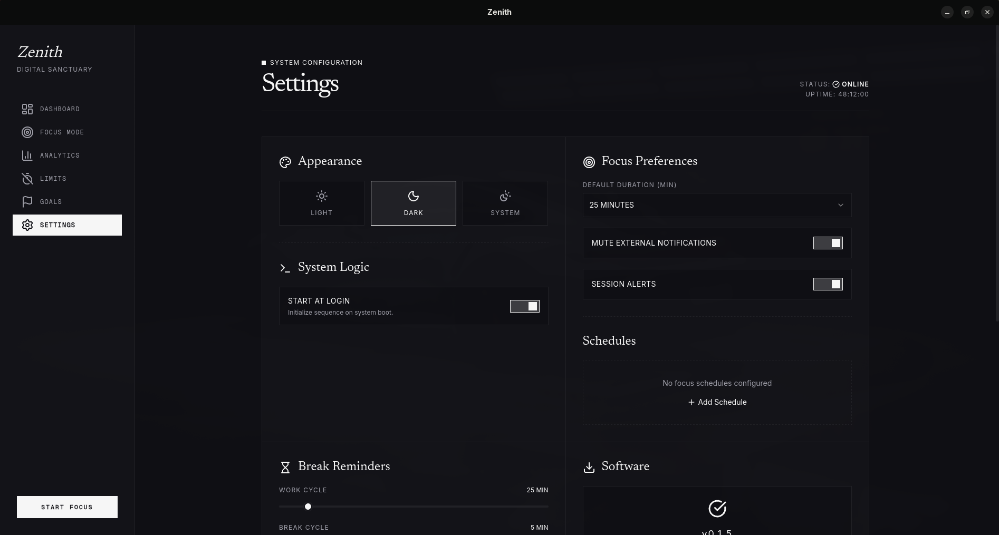

# Zenith — Digital Sanctuary

A high-fidelity digital wellbeing platform for reclaiming cognitive sovereignty. Built with Tauri, React, and TypeScript.


## Table of Contents

- [Features](#features)
- [Screenshots](#screenshots)
- [Installation](#installation)
- [Usage](#usage)
- [Architecture](#architecture)
- [Development](#development)
- [Contributing](#contributing)
- [License](#license)

## Features

### Core Functionality
- **Usage Tracking** - Automatic tracking of application usage time with session detection and deduplication
- **App Limits** - Set daily time limits for applications with optional hard blocking (process termination / window title matching)
- **Focus Mode** - Proactively block distracting apps with scheduled focus sessions & emergency bypass options
- **Break Reminders** - Pomodoro-style notifications to encourage healthy breaks
- **Goal Setting & Onboarding** - Guided onboarding wizard, daily screen time goals, and achievement tracking
- **Single Instance Enforcement** - Prevents multiple concurrent application instances using native process locks

### Analytics & History
- **Dashboard** - Real-time overview of today's usage with charts and cognitive load statistics
- **4-Week Telemetry Navigation** - Interactive multi-week navigation allowing historical weekly usage exploration up to 30 days
- **Category Tracking** - Organize apps into categories (Work, Social, Entertainment, etc.) with custom category management
- **Data Export & Import** - Export and import usage data as CSV or JSON with date range selection

### Platform & OS Integration
- **Cross-Platform** - Native tracking and window detection support on Linux (Hyprland, Sway, X11) and Windows (Win32)
- **Windows Features** - UWP application scanning, shortcut (`.lnk`) resolution, native icon extraction, and window title blocking
- **Dark Mode** - Brutalist monochrome design system powered by OKLCH colors and modern typography (Newsreader, Inter, Geist Mono)
- **System Tray** - Background autostart support and system tray integration with quick actions
- **Keyboard Shortcuts** - Full keyboard navigation support
- **Notifications** - Customizable notification thresholds with Do Not Disturb modes

## Screenshots

<details>
<summary>Click to view screenshots</summary>

### Dashboard


### Analytics


### Focus Mode


### Settings


</details>

## Installation

### Arch Linux (AUR)

```bash
# Using yay
yay -S zenith

# Or using paru
paru -S zenith
```

### From Source

#### Prerequisites

- [Node.js](https://nodejs.org/) (v18 or later)
- [Rust](https://www.rust-lang.org/tools/install) (latest stable)
- System dependencies:
  ```bash
  # Ubuntu/Debian
  sudo apt install libwebkit2gtk-4.1-dev build-essential curl wget file libxdo-dev libssl-dev libayatana-appindicator3-dev librsvg2-dev

  # Arch Linux
  sudo pacman -S webkit2gtk-4.1 base-devel curl wget file xdotool openssl libayatana-appindicator librsvg
  ```

#### Build Steps

```bash
# Clone the repository
git clone https://github.com/AzlanEh/zenith.git
cd zenith

# Install dependencies
npm install

# Development mode
npm run tauri dev

# Production build
npm run tauri build
```

The built application will be in `src-tauri/target/release/bundle/`.

## Usage

### Keyboard Shortcuts

| Shortcut | Action |
|----------|--------|
| `Ctrl+1` | Dashboard |
| `Ctrl+2` | History |
| `Ctrl+3` | Goals |
| `Ctrl+4` | App Limits |
| `Ctrl+5` | Settings |
| `Ctrl+R` | Refresh data |

### Setting App Limits

1. Navigate to **App Limits** (Ctrl+4)
2. Click **Add New Limit**
3. Select an app from the list or enter a custom name
4. Set the daily time limit
5. Optionally enable **Hard Block** to force-quit apps when the limit is reached

### Focus Mode

1. Navigate to **Focus Mode** via the sidebar
2. Add apps to your block list
3. Start a focus session with a set duration
4. Optionally schedule recurring focus sessions

### Exporting Data

1. Go to **Settings** (Ctrl+5)
2. Scroll to **Export Data**
3. Select your date range
4. Choose CSV or JSON format
5. Click **Export** and select save location

## Architecture

```
zenith/
├── src/                    # Frontend (React 19 + TypeScript)
│   ├── components/         # UI components (Shadcn/UI, Dashboard, Focus, Goals)
│   ├── hooks/             # Custom React hooks (useDarkMode, usePeriodicRefresh)
│   ├── queries/           # TanStack Query v5 hooks
│   ├── services/          # API service layer (Tauri invoke wrappers)
│   ├── store/             # Zustand state management (useUIStore)
│   ├── types/             # TypeScript type definitions
│   └── utils/             # Utility functions and logger
│
├── src-tauri/             # Backend (Rust + Tauri 2.0)
│   └── src/
│       ├── lib.rs         # Main entry, single-instance lock, command routing
│       ├── app_scanner.rs # Desktop & UWP app scanner, shortcut & icon resolver
│       ├── autostart.rs   # Systemd, XDG autostart, and Windows registry autostart
│       ├── database.rs    # SQLite storage, usage tracking, retention & migrations
│       ├── window_tracker.rs # Hyprland/Sway/X11 & Win32 window detection
│       ├── tracker.rs     # Active window telemetry logger & idle detection
│       ├── focus_mode.rs  # Focus sessions, schedule engine & process blocking
│       ├── break_reminder.rs # Break reminder timer logic
│       ├── goals.rs       # Goals management & achievement calculation
│       ├── migrations.rs  # Schema migrations (deduplication & indexes)
│       └── tray.rs        # System tray icon and menu handler
│
├── e2e/                   # Playwright E2E tests
└── pkg/                   # Packaging (PKGBUILD, desktop entry)
```

### Technology Stack

- **Frontend**: React 19, TypeScript, Tailwind CSS v4, Shadcn/UI, Recharts, TanStack Query v5
- **Backend**: Rust, Tauri 2.0 (`tauri-plugin-single-instance`, `active-win-pos-rs`, `user-idle`)
- **Database**: SQLite (via `rusqlite` with auto 90-day retention & migrations)
- **State Management**: Zustand
- **Testing**: Vitest (unit & component tests), Playwright (E2E)

## Development

### Available Scripts

```bash
# Start development server
npm run dev

# Run frontend type checking
npm run typecheck

# Run ESLint
npm run lint

# Run unit tests
npm run test

# Run E2E tests
npm run test:e2e

# Run Rust tests
cd src-tauri && cargo test

# Build for production
npm run tauri build
```

### Project Structure

| Directory | Description |
|-----------|-------------|
| `src/components/` | React components |
| `src/hooks/` | Custom React hooks |
| `src/store/` | Zustand store |
| `src/services/` | Tauri API wrappers |
| `src-tauri/src/` | Rust backend |
| `e2e/` | Playwright tests |

## Contributing

We welcome contributions! Please see [CONTRIBUTING.md](docs/CONTRIBUTING.md) for guidelines.

### Development Setup

1. Fork the repository
2. Create a feature branch (`git checkout -b feature/amazing-feature`)
3. Make your changes
4. Run tests (`npm run test && npm run lint`)
5. Commit your changes (`git commit -m 'Add amazing feature'`)
6. Push to the branch (`git push origin feature/amazing-feature`)
7. Open a Pull Request

### Code Style

- TypeScript/React follows ESLint configuration
- Rust code uses `cargo fmt` and `cargo clippy`
- Pre-commit hooks are enabled via Husky

## License

This project is licensed under the MIT License - see the [LICENSE](LICENSE) file for details.

## Acknowledgments

- [Tauri](https://tauri.app/) - Framework for building desktop apps
- [Shadcn/UI](https://ui.shadcn.com/) - UI component library
- [Recharts](https://recharts.org/) - Charting library
- [Lucide Icons](https://lucide.dev/) - Icon set
